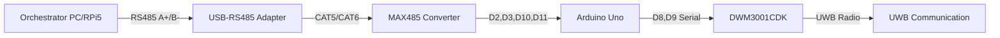
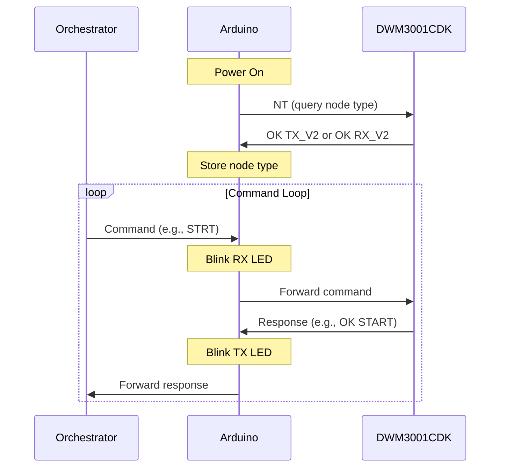

# Arduino RS485 Bridge Firmware Plan

## Architecture Overview

The Arduino Uno acts as a transparent communication bridge between the orchestrator (via RS485) and the DWM3001CDK board (via TTL Serial).



## Pin Assignments

### RS485 Communication (MAX485 → Arduino)

- **D2** = RE (Receiver Enable, active LOW)
- **D3** = DE (Driver Enable, active HIGH)  
- **D10** = RO (Receiver Output, reads from MAX485)
- **D11** = DI (Data Input, writes to MAX485)
- **GND** = GND
- **5V** = VCC

### DWM3001CDK Communication (Arduino → DWM3001CDK)

- **D8** = RX (from DWM3001CDK GPIO14/TXD0)
- **D9** = TX (to DWM3001CDK GPIO15/RXD0)
- **GND** = Common ground

### LED Indicators (External LEDs + Resistors)

- **D4** = RX Activity LED (blinks when receiving from orchestrator)
- **D5** = TX Activity LED (blinks when transmitting to orchestrator)
- **D6** = Error LED (lights up on communication errors)
- **D13** = Built-in LED (heartbeat/alive indicator)

## Firmware Structure

### Single Unified Firmware

Create [`Arduino/RS485_Bridge/RS485_Bridge.ino`](Arduino/RS485_Bridge/RS485_Bridge.ino) with the following structure:

**1. Global Configuration**

```cpp
// Pin definitions
#define RS485_DE_PIN 3
#define RS485_RE_PIN 2
#define RS485_RO_PIN 10  // SoftwareSerial RX
#define RS485_DI_PIN 11  // SoftwareSerial TX

#define DWM_RX_PIN 8     // Arduino RX from DWM TX
#define DWM_TX_PIN 9     // Arduino TX to DWM RX

#define LED_RX_PIN 4
#define LED_TX_PIN 5
#define LED_ERROR_PIN 6
#define LED_HEARTBEAT_PIN 13

#define BAUD_RATE 115200
#define RS485_TX_DELAY_US 100  // Delay for transceiver switching
#define COMMAND_BUFFER_SIZE 256
```

**2. Core Functions**

- `setup()`: Initialize serial ports, pins, LEDs, perform handshake with DWM3001CDK
- `loop()`: Main event loop - check for RS485 data, forward to DWM, relay responses
- `rs485_receive()`: Read command from orchestrator via RS485
- `rs485_send()`: Send response to orchestrator via RS485 (with DE/RE control)
- `dwm_send_command()`: Forward command to DWM3001CDK
- `dwm_receive_response()`: Read response from DWM3001CDK
- `set_rs485_tx_mode()`: Set DE=HIGH, RE=HIGH (transmit mode)
- `set_rs485_rx_mode()`: Set DE=LOW, RE=LOW (receive mode)
- `blink_led()`: Non-blocking LED blink utility
- `send_error()`: Send error response to orchestrator
- `perform_handshake()`: Startup handshake with DWM3001CDK

**3. Communication Flow**



## Implementation Details

### RS485 Direction Control

The MAX485 transceiver requires proper DE/RE control for half-duplex communication:

- **Receive Mode** (default): DE=LOW, RE=LOW
- **Transmit Mode**: DE=HIGH, RE=HIGH
- **Switching delays**: 100μs before/after transmission for transceiver settling
```cpp
void set_rs485_tx_mode() {
  digitalWrite(RS485_DE_PIN, HIGH);
  digitalWrite(RS485_RE_PIN, HIGH);
  delayMicroseconds(RS485_TX_DELAY_US);
}

void set_rs485_rx_mode() {
  RS485Serial.flush(); // Wait for transmission complete
  delayMicroseconds(RS485_TX_DELAY_US);
  digitalWrite(RS485_DE_PIN, LOW);
  digitalWrite(RS485_RE_PIN, LOW);
}
```


### Transparent Pass-Through

Arduino forwards commands without modification:

1. Read complete command from RS485 (until `\r` or `\n`)
2. Forward entire command to DWM3001CDK
3. Wait for DWM response (until `\r` or `\n`)
4. Forward entire response back to orchestrator

### Error Handling

Return error responses to orchestrator when:

- DWM3001CDK doesn't respond (timeout - not implemented per requirements, but handle serial errors)
- Invalid data received
- Communication errors

Error format: `ERR_<ERROR_TYPE>\r\n`

Examples:

- `ERR_DWM_NO_RESPONSE\r\n`
- `ERR_INVALID_DATA\r\n`
- `ERR_RS485_TIMEOUT\r\n`

### Startup Handshake

On power-up, Arduino will:

1. Initialize both serial ports (RS485 and DWM)
2. Wait 500ms for DWM3001CDK to stabilize
3. Send `NT` command to query node type
4. Wait for response (`OK TX_V2` or `OK RX_V2`)
5. Store node type for diagnostic purposes
6. Blink LEDs to indicate ready state

If handshake fails:

- Blink error LED rapidly
- Send `ERR_HANDSHAKE_FAILED\r\n` if orchestrator sends command
- Continue attempting to communicate with DWM

### LED Behavior

- **RX LED (D4)**: 50ms blink when receiving command from orchestrator
- **TX LED (D5)**: 50ms blink when sending response to orchestrator
- **Error LED (D6)**: Solid ON during error, OFF when cleared
- **Heartbeat LED (D13)**: 1Hz blink (500ms on, 500ms off) to show Arduino is alive

## DWM3001CDK Firmware Modifications

The existing DWM3001CDK firmware in [`Src/examples/ex_22_orchestrator_v2/`](Src/examples/ex_22_orchestrator_v2/) already supports all required commands and uses GPIO14/GPIO15 for UART at 115200 baud.

**Potential modifications needed:**

1. **Remove RS485_DE_PIN handling** (lines 264-271, 440-442, 518-520 in both TX and RX firmware)

   - Arduino now handles RS485 direction control
   - DWM3001CDK uses simple TTL serial (no DE/RE control)
   - Remove `#ifdef RS485_DE_PIN` blocks

2. **Verify UART pin configuration**

   - Ensure `UART_0_RX_PIN = 15` (GPIO15, J10 Pin 10)
   - Ensure `UART_0_TX_PIN = 14` (GPIO14, J10 Pin 8)
   - These connect to Arduino D9 (TX) and D8 (RX) respectively

## File Structure

```
Arduino/
├── RS485_Bridge/
│   ├── RS485_Bridge.ino          # Main firmware file
│   ├── README.md                  # Setup and wiring instructions
│   └── wiring_diagram.png         # Visual wiring diagram (if available)
```

## Library Dependencies

- **SoftwareSerial** (built-in): For RS485 communication on D10/D11
- **SoftwareSerial** (built-in): For DWM3001CDK communication on D8/D9

Note: Arduino Uno has only one hardware serial port (D0/D1), which is used for USB debugging. We use two SoftwareSerial instances for RS485 and DWM communication.

## Testing Strategy

1. **Arduino-only test**: Upload firmware, connect to Serial Monitor, verify LED patterns
2. **RS485 loopback test**: Connect RS485 TX to RX, verify echo
3. **DWM communication test**: Send commands to Arduino, verify DWM responses
4. **End-to-end test**: Full orchestrator → Arduino → DWM → Arduino → orchestrator loop
5. **Error handling test**: Disconnect DWM, verify error responses
6. **Stress test**: Send rapid commands, verify no data loss or corruption

## Known Limitations

- **SoftwareSerial at 115200 baud**: May have occasional errors on Arduino Uno due to software limitations. If issues occur, consider reducing baud rate to 57600.
- **No command buffering**: Arduino processes one command at a time. Orchestrator should wait for response before sending next command.
- **No timeout handling**: Arduino waits indefinitely for DWM responses (per requirements). Orchestrator should implement timeouts.